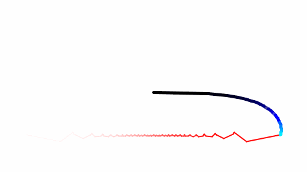

Fourier Series Animation
========================

Processing code for a visualization of the Fourier series for a square wave.

                    1          1          1               
    f(t) = sin(t) + -sin(3t) + -sin(5t) + -sin(7t) + ldots
                    3          5          7

The height of a point moving in a circle with constant velocity is parametrized by the sine function. In this animation, 30 rotating arms are attached to each other in a chain. The second arm is 1313 the length of the first, the third is 1515 the length of the first, and so on. The second rotates 3 times faster than the first, the third rotates 5 times faster than the first, and so on. As a result, the end of the last arm traces a square wave.
